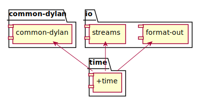
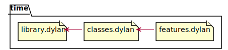
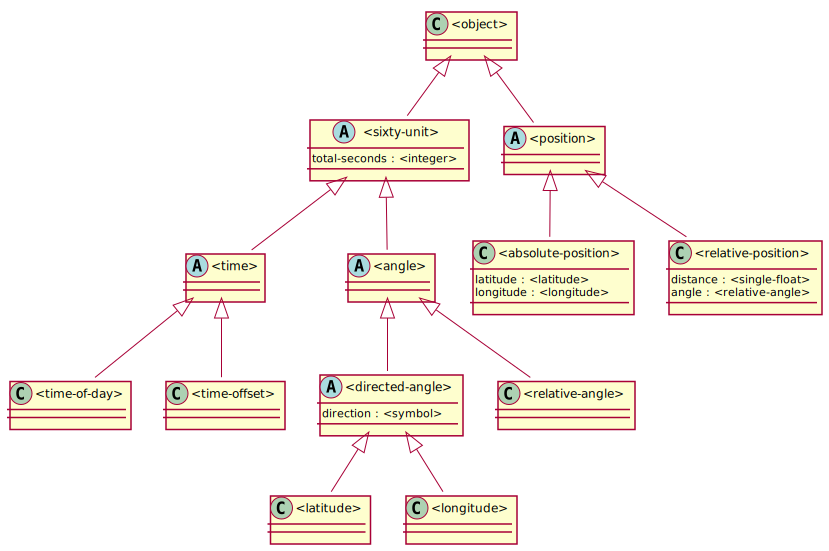

# Architecture

- [Library and modules](#library-and-modules)
- [Source files](#source-files)
- [Classes](#classes) ([diagram](#class-diagram)) 

TOC of Classes:

- [`<sixty-unit>`](#sixty-unit)
- [`<time>`](#time)

## Library and modules

## Source files

## Classes

One difference with the book is that most classes are `constant`, and
every command that can change and object creates a new instance.

### Class diagram

You can see the class diagram defined in plantuml in the file
"../doc/uml/class-diagram.plantuml".

### Classes exported

| Legend | Description  |
| :--    | :--          |
| a      | abstract     |
| c      | concrete     |
| i      | instantiable |
| o      | open         |
| s      | sealed       |

- [`<sixty-unit>`](#sixty-unit) (ao): unit of measure with 60 base.                           
- [`<time>`](#time) (ao): represent the pass of time or point in time             
- `<angle>` (ao): angle of the plane                                      
- `<time-of-day>` (co): an event happened at this point of the day              
- `<time-offset>` (co): an event happened some time ago
- `<position>` (ao)
- `<absolute-position>` (co)
- `<relative-position>` (co)
- `<directed-angle>` (co)
- `<latitude>`
- `<longitude>`

### Sixty unit

`<sixty-unit>` is a class that can be converted either hours, minutes
and seconds, or to degrees, minutes and seconds. In the methods for
encoding and decoding total seconds, we use the name `max-unit` to
refer to the unit that is hours for time, and degrees for positions.

### Time

A specific time of day from 00:00 (midnight) to below 24:00
(tomorrow).

### Latitude

Valid `direction` must be `#"north"` or `#"south"`

### Longitude

Valid `direction` must be `#"east"` or `#"west"`

## Features

- `total-seconds(<sixty-unit>) => <integer>`
- `encode-total-seconds(<integer>,<integer>,<integer>) => <integer>`
- `decode-total-seconds(<integer>) => (<integer>,<integer>,<integer>)`
- `+(<time-offset>, <time-offset>) => <time-offset>`
- `+(<time-offset>, <time-of-day>) => <time-of-day>`
- `+(<time-of-day>, <time-offset>) => <time-of-day>`
- `+(<time-offset>, <time-of-day>) => <time-of-day>`
- `past?(<time-offset>) => <boolean>`
- `angle(<relative-position>) => <relative-angle>`
- `distance(<relative-position>) => <single-float>`
- `direction(<directed-angle>) => <string>`
- `as(<string>,<sixty-unit>) => <string>`
- `as(<string>,<time>) => <string>`
- `as(<string>,<time-offset>) => <string>`
- `as(<string>,<angle>) => <string>`