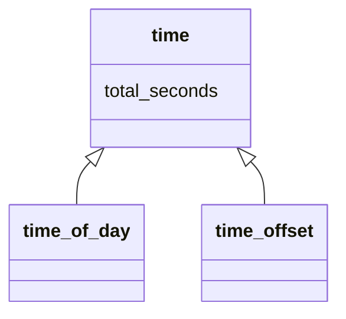
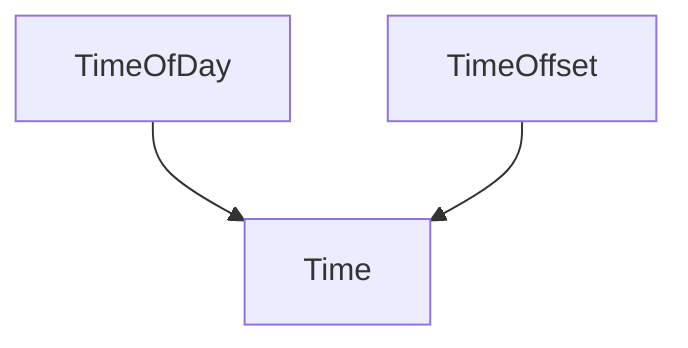

# Architecture

## Class diagram

### <time>





### <directed-angle>

```mermaid
classDiagram
"<directed-angle>" : total-seconds
"<directed-angle>" : direction
"<directed-angle>" <|-- "<latitude>"
"<directed-angle>" <|-- "<longitude>"
``` 

### <position>

```mermaid
classDiagram
"<position>" <|-- "<absolute-position>"
"<position>" <|-- "<relative-position>"
```
