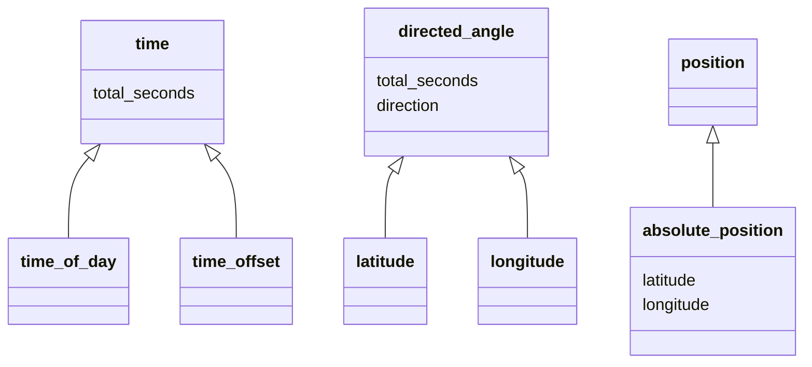

# Architecture

## Class diagram

## Time

### `<time>`

- `decode-total-seconds(<object>) => (hh, mm, ss)`
- `as(<time>) => <string>`

### `<time-offset>`

- `past?(<time-offset>) => <boolean>`
- `+(<time-offset>, <time-offset>) => <time-offset>`
- `+(<time-offset>, <time-of-day>) => <time-of-day>`
- `+(<time-of-day>, <time-offset>) => <time-of-day>`