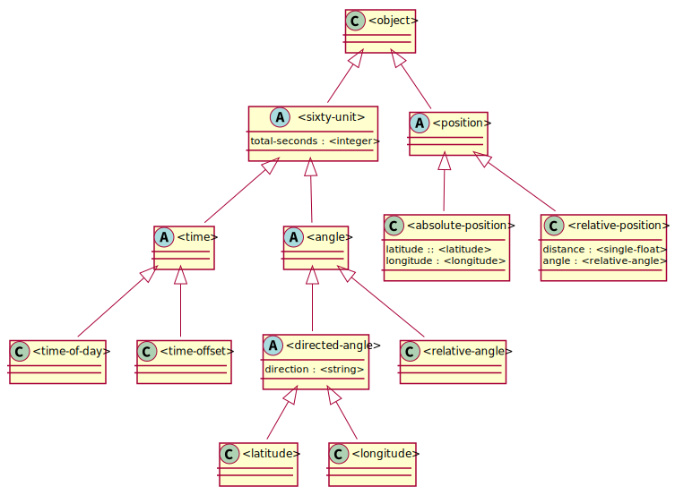

# Architecture

| Legend | Description  |
| :--    | :--          |
| a      | abstract     |
| c      | concrete     |
| i      | instantiable |
| o      | open         |
| s      | sealed       |

## Class diagram

## Library

- `<sixty-unit>`, unit of measure with 60 base.                           
- `<time>`, represent the pass of time or point in time             
- `<angle>`, angle of the plane                                      
- `<time-of-day>`, an event happened at this point of the day              
- `<time-offset>`, an event happened some time ago                         

## Classes

### `<time>` (ao)

#### Superclasses

- `<sixty-unit>`

#### Queries

- `as(<string>,<sixty-unit>) => <string>`

### `<time-offset>` (cio)

#### Superclasses

- `<time>`

#### Queries

- `as(<string>, <time-offset>) => <string>`
- `+(<time-offset>, <time-offset>) => <time-offset>`
- `+(<time-offset>, <time-of-day>) => <time-of-day>`
- `past?(<time-offset>) => <boolean>`
- `+(<time-of-day>, <time-offset>) => <time-of-day>`
- `+(<time-offset>, <time-of-day>) => <time-of-day>`